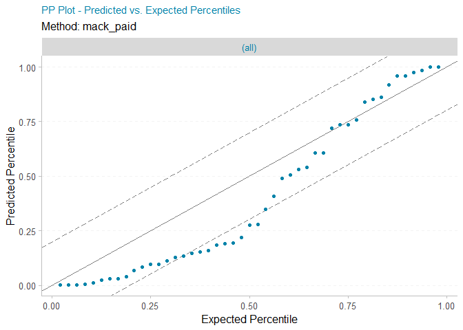

<!-- README.md is generated from README.Rmd. Please edit that file -->

<!-- badges: start -->

[](https://travis-ci.org/problemofpoints/reservetestr)
[](https://ci.appveyor.com/project/problemofpoints/reservetestr)
[](https://www.tidyverse.org/lifecycle/#maturing)
[](https://codecov.io/github/problemofpoints/reservetestr?branch=master)
<!-- badges: end -->

# reservetestr

The goal of reservetestr is to provide a framework for testing loss
reserve methods. Specifically, an interface to test methods against the
[Casualty Actuarial Society (CAS) Loss Reserve
Database](http://www.casact.org/research/index.cfm?fa=loss_reserves_data)
is provided.

## Installation

You can install reservetestr from GitHub with:

``` r
# install.packages("devtools")
devtools::install_github("problemofpoints/reservetestr", upgrade_dependencies = FALSE)
```

## Example Usage

``` r
library(reservetestr)
suppressPackageStartupMessages(library(ChainLadder))
#> Warning: package 'ChainLadder' was built under R version 3.4.4
library(dplyr)
#> Warning: package 'dplyr' was built under R version 3.4.4
#> 
#> Attaching package: 'dplyr'
#> The following objects are masked from 'package:stats':
#> 
#>     filter, lag
#> The following objects are masked from 'package:base':
#> 
#>     intersect, setdiff, setequal, union
library(tidyr)
#> Warning: package 'tidyr' was built under R version 3.4.4
library(purrr)
#> Warning: package 'purrr' was built under R version 3.4.4
library(ggplot2)
#> Warning: package 'ggplot2' was built under R version 3.4.4

reservetestr::ggSetTheme()
```

## CAS Loss Reserve Database

From the [CAS
website](http://www.casact.org/research/index.cfm?fa=loss_reserves_data):

> “Our goal is to prepare a clean and nice data set of loss triangles
> that could be used for claims reserving studies. The data includes
> major personal and commercial lines of business from U.S. property
> casualty insurers. The claims data comes from Schedule P - Analysis of
> Losses and Loss Expenses in the National Association of Insurance
> Commissioners (NAIC) database.”

Below is an example paid loss triangle from the database. The first
triangle is the upper triangle used to fit the model. The second
triangle is the actual lower right of the triangle used for model
validation / testing.

``` r
cas_loss_reserve_db %>%
  get_meyers_subset() %>%
  filter(line == "ppauto" & group_id == 388) %>%
  pluck("train_tri_set", 1, "paid")
#> Warning: package 'bindrcpp' was built under R version 3.4.4
#>       dev_lag
#> acc_yr     1     2     3     4     5     6     7     8     9    10
#>   1988 13440 35680 48703 56319 61018 61119 63049 63556 63744 63835
#>   1989 18757 44166 57578 66264 65600 67721 75369 76713 77007    NA
#>   1990 19834 42225 56347 63194 67112 69459 74267 79208    NA    NA
#>   1991 16230 38045 46055 53983 60638 62917 71074    NA    NA    NA
#>   1992 14629 22427 33873 43339 53168 60413    NA    NA    NA    NA
#>   1993 24597 51373 68484 80253 92192    NA    NA    NA    NA    NA
#>   1994 31723 59733 77398 94395    NA    NA    NA    NA    NA    NA
#>   1995 37397 71133 94294    NA    NA    NA    NA    NA    NA    NA
#>   1996 53670 98628    NA    NA    NA    NA    NA    NA    NA    NA
#>   1997 52837    NA    NA    NA    NA    NA    NA    NA    NA    NA
#> attr(,"exposure")
#>  [1]  83473  91800  95877  99256  96170 139038 152174 167833 180523 164717
```

The back-testing results use a subset of the full database, resulting in
50 triangles across four lines of business - comauto, othliab, ppauto,
wkcomp. For this example, we will only use “comauto”.

``` r
cas_db_subset <- cas_loss_reserve_db %>%
  get_meyers_subset()
```

The main function is `run_single_backtest` which, in this example, runs
the `ChainLadder::MackChainLadder` method on each paid loss triangle.

``` r
mack_paid_results <- run_single_backtest(cas_db_subset, 
                                         testr_MackChainLadder, 
                                         lines_to_include = "comauto",
                                         loss_type_to_backtest = "paid", 
                                         method_label = "mack_paid")
```

The output provided is the below.

``` r
glimpse(mack_paid_results)
#> Observations: 47
#> Variables: 11
#> $ line              <chr> "comauto", "comauto", "comauto", "comauto", ...
#> $ group_id          <dbl> 353, 388, 620, 833, 1066, 1090, 1538, 1767, ...
#> $ company           <chr> "Celina Mut Grp", "Federal Ins Co Grp", "Emp...
#> $ method            <chr> "mack_paid", "mack_paid", "mack_paid", "mack...
#> $ actual_ultimate   <dbl> 40000, 745997, 388485, 24613, 63022, 21354, ...
#> $ actual_unpaid     <dbl> 7399, 189270, 89855, 2959, 5269, 3474, 16640...
#> $ mean_ultimate_est <dbl> 39177.438, 714600.238, 398408.978, 25350.326...
#> $ mean_unpaid_est   <dbl> 6576.4378, 157873.2378, 99778.9781, 3696.325...
#> $ stddev_est        <dbl> 1442.5094, 46454.1901, 9466.1578, 836.7769, ...
#> $ cv_unpaid_est     <dbl> 0.21934510, 0.29424994, 0.09487126, 0.226380...
#> $ implied_pctl      <dbl> 0.7200268344, 0.7563488511, 0.1468789988, 0....
```

We can create a p-p plot to visually access the accuracy of our
estimates. If our method was perfect, we would expect to see the dots
fall along the 45 degree line - indicating that our implied percentiles
are perfectly uniform.

That is not the case in this example, so for “comauto” the Mack method
applied to paid data does not back-test well.

``` r
create_pp_plot(mack_paid_results, by_line = TRUE)
```



## Future Enhancements

  - Add error metrics for deterministic methods
  - Create an object structure using S3 class system
  - Add more error handling
  - Add `testr_` functions for the other methods in `ChainLadder`
  - Add ability to test several methods at once
